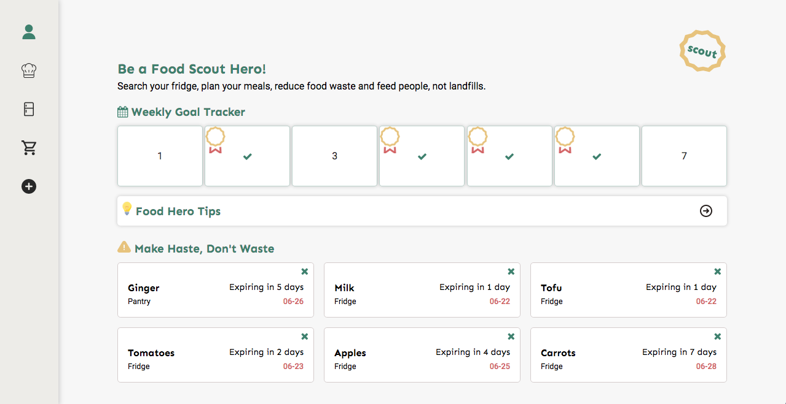
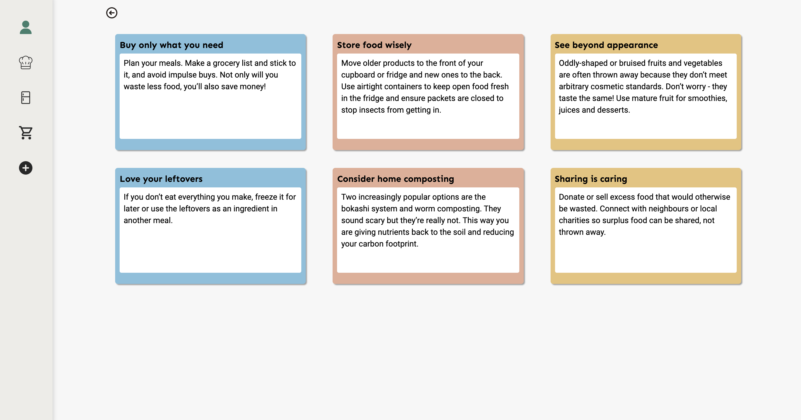
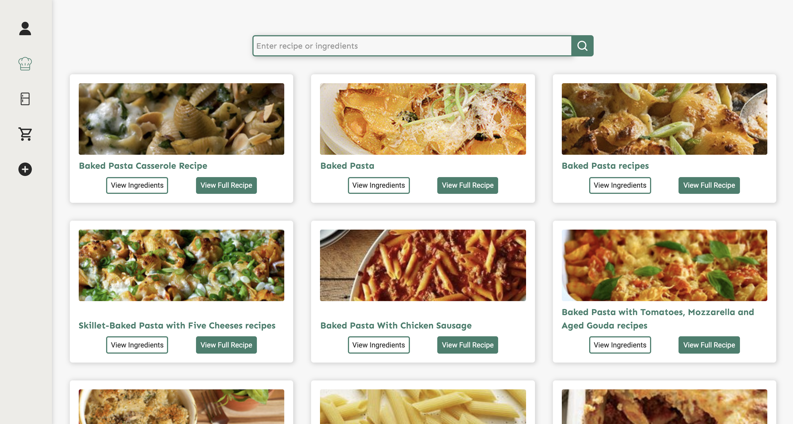
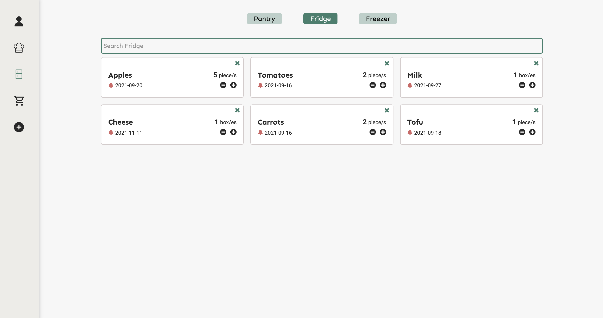
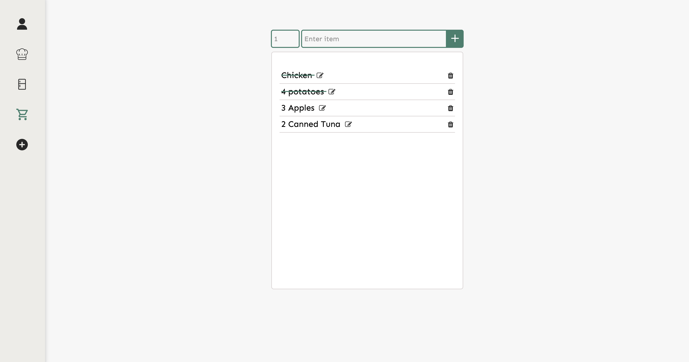
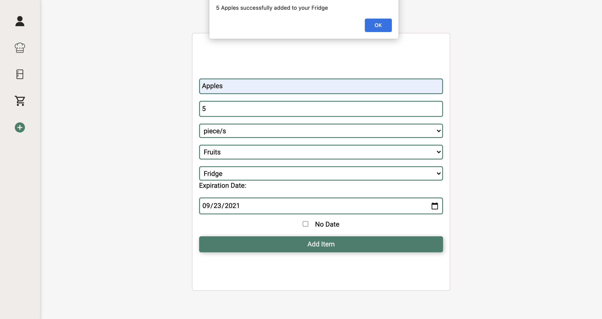

# Scout - Food App

[Scout](https://yvettetan.github.io/batch8-frontend-activities/Scout/index.html) is a multi-featured food tracking application that helps users to reduce food waste at home.

The objective of the project was to build an app that helps address a problem of a community and integrates with a third-party API as a new learning outcome.

## Table of contents

- [Overview](#overview)
  - [Features](#features)
  - [Screenshot](#screenshot)
- [The Process](#the-process)
  - [Technologies](#technologies)
- [Useful Resources](#useful-resources)

## Overview

### Features

- Add food items to different locations: pantry, fridge, freezer
- Filter food items in each location
- View expiring food items (within a week)
- Search for food recipes and view their respective ingredients
- Create a grocery list and mark items off the list
- View tips on how to reduce food waste
- Track weekly goal

### Screenshot
Home:

Tips:

Search Recipes:

View Items:

Grocery List:

Add Food Items:

## The Process

### Technologies

This project was built with:

  

- Third-party API: [Edamam](https://developer.edamam.com/)
- Icons from [flaticon](https://www.flaticon.com/)

**Note: The app uses localStorage to store data after the browser is closed.**

## Useful Resources

- [Comprehensive list of public APIs](https://github.com/public-apis/public-apis)
- [Codrops - CSS Reference](https://tympanus.net/codrops/css_reference/)
